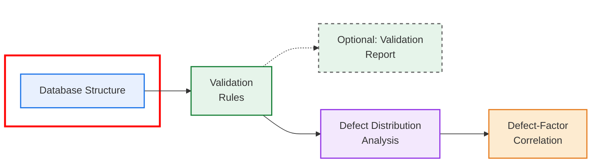

# Database schema for Defect-Level Sewer Pipe Condition Modeling


## Project overview

The diagram below provides an overview of the project workflow, which is organized into four main steps and one optional component. This repository corresponds to the database structure step, highlighted in red in the figure.


## Database Structure- Repository
This repository provides the complete database structure developed for the paper _Data Requirements for Defect-Level Sewer Pipe Condition Modeling: a State-of-the-Art Review_. Its purpose is to translate the conceptual Entity–Relationship Diagram (ERD) (see Fig. 5 in the manuscript) into an executable relational schema using Python, ensuring a coherent and well-organized representation of all entities, attributes, and relationships involved in defect-level sewer condition analysis.

The database is implemented using SQLAlchemy, which functions as the Object–Relational Mapper (ORM) to:

* Define each ERD entity as a Python class,
* Specify all attributes with their corresponding data types,
* Manage the relationships between entities within a relational structure.

The schema is designed to:

* Represent the key entities commonly involved in sewer deterioration studies,
* Explicitly store the attributes (fileds) associated with each entity,
* Model the relationships between tables, including one-to-many and many-to-many structures,
* Support future analyses focusing on factors, defects, failures, and additional aspects relevant to sewer system performance.

---

## Repository Contents

`schema.py`

Defines the full relational schema of the database using SQLAlchemy. This file implements every entity in the ERD, organized into the three conceptual sections used in the study:

* **Factors:** contains physical, environmental, climatic, operational, and geospatial factors that influence sewer deterioration.
* **Defects:** stores inspection events (e.g., CCTV) and defect-level observations extracted from these inspections.
* **Failures:** records failure events affecting the sewer system, including their causes, impacts, and connection to pipe interventions.

It defines all attributes, data types, primary keys, foreign keys, and the complete set of one-to-many and many-to-many relationships.

> **Important note:** The data types defined in this schema follow those specified in the ERD. However, they can be adapted depending on the characteristics of the input data. For example, identifiers such as Pipe_ID are defined as numeric in this implementation but may be stored as strings if they contain alphanumeric values in other datasets.

---

`database.py`

Handles the database configuration and creation process. It includes:

* The SQLite engine definition,
* The session factory (`SessionLocal`) used to interact with the database,
* The `create_tables()` function, which generates all tables defined in `schema.py`.

This file does not define entities; it simply initializes the database and manages the connection.

---

`Database_Creation_and_Usage.ipynb`

A demonstration notebook showing how to interact with the implemented database. It includes:

* Code to run `create_tables()` and generate the database file,
* A command to display the full path of the created SQLite database,
* Example (commented) code for loading Excel files into pandas and uploading them to the corresponding tables.

This notebook serves as a practical guide for users who want to populate or explore the database once the schema has been created.

---

## Requirements

To run the database schema and interact with the relational models, the following dependencies are required:

* Python 3.8+
* pandas
* SQLAlchemy

Additional optional dependencies:

* openpyxl – required if working with Excel files
* Jupyter Notebook – only needed to run the example notebook

All required packages can be installed using:

```bash
pip install -r requirements.txt
```
---

## How to Create the Database

To generate the database structure and create all tables defined in the ERD, run the `create_tables()` function from the `database.py` module.

**1. Import and run the table creation function**
```
from database import create_tables

create_tables()
```

This will create the file `sewer_database.db` in the project directory (unless a different path is specified in the database URL).

**2. (Optional) View the full path of the generated database**

If you want to confirm where the SQLite file was created, run:

```
from database import engine
import os

print(os.path.abspath(engine.url.database))
```

**3. Result**

After running these commands:

1. All entities defined in `schema.py` will be created as tables,
3. All relationships (one-to-many and many-to-many) will be enforced through foreign keys,
5. The database will be ready to receive data from CSV, Excel, or other structured formats.

---

## Loading Data Into the Database

Once the database has been created, data can be inserted into any of the tables defined in the schema. The workflow consists of two main steps:

1. Read the data into a pandas DataFrame
2. Upload the DataFrame into the database  

### 1. Reading Data

The project includes helper functions to load data into pandas DataFrames. For example, Excel files can be read using:

```python

pipes_df = read_excel_to_dataframe(
        excel_path="path/to/file.xlsx",
        sheet_name="PIPES"
    )
```

### 2. Uploading Data into the Database 

To upload data, import the corresponding SQLAlchemy model from `schema.py` and use the helper function `upload_dataframe_to_table` along with the database engine:

```python
upload_dataframe_to_table(
        df=pipes_df,
        model_cls=Pipe,
        engine=engine,
    )
```
### 3. Running the Full Code
The full workflow is implemented in the Jupyter Notebook:

`Database_Creation_and_Usage.ipynb`

To run the code, update the file path:

```python
excel_file = "path/to/your/input_file.xlsx"
```
Then execute all cells in the notebook.

### 4. Example Dataset 

An example Excel file `EXAMPLE_DATA_DataBase.xlsx` is provided in the repository to demonstrate the expected data structure and allow users to run the notebook directly.

This file includes sample data for the main entities (e.g., Pipes, Inspections, Defects) and can be used to:

* Test the database creation
* Validate the data upload process
* Understand the required input format

### 5. Notes

* The DataFrame must contain columns that match the attribute names in the SQLAlchemy model.
* Missing values (NaN) will be inserted as NULL.
* Additional preprocessing (type conversions, renaming columns) can be performed before uploading.
* This process can be repeated for any entity in the ERD (e.g., Manhole, Inspection, Defect, Failure, etc.).

---

## Extend or adapt the schema (optional)

If necessary, you can modify or expand the database structure by updating `schema.py`:

* Add new attributes
* Add new entities
* Create additional relationships
* Change data types

After modifying the schema, run `create_tables()` again to regenerate the structure.

---

## Citation

If you use this database structure, the ERD, or any component of this repository in your research, please cite the corresponding paper:

González, M. A., Herrán, J., van Zyl, J. E., & Henning, T. F. P. (2025). 
Data Requirements for Defect-Level Sewer Pipe Condition Modeling: A State-of-the-Art Review. _Journal of Water Resources Planning and Management_.

---

## License

This project is distributed under the MIT License.
See the `LICENSE` file for the full text.

---

## Contact

For questions, feedback, or collaboration inquiries related to the paper or this database structure, please contact the corresponding author:

**María A. González**  
Email: _mgon869@aucklanduni.ac.nz_  
Affiliation: University of Auckland
